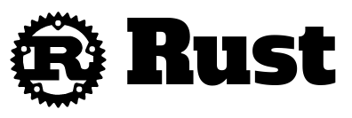
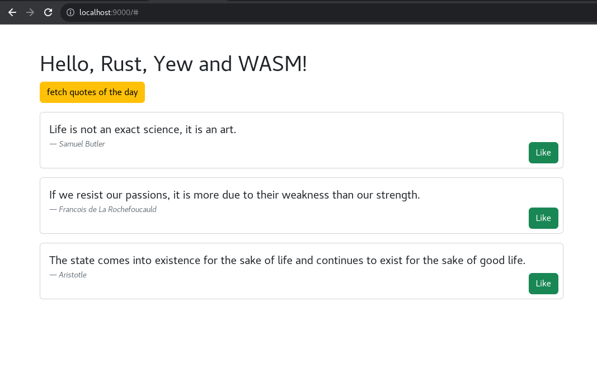

# Rust-Webassembly-Yew-Async

Demo of a web app in Rust with the Yew framework, compiled to WebAssembly. It's just a simple application that fetches quotes from an HTTP API, parses JSON and displays the quotes. NodeJS and Webpack are used to package the project, and serve as the development environment.

<table border="0">
 <tr>
    <td></td>
    <td></td>
    <td></td>
 </tr>
</table>

## Install Rust ++
See: https://www.rust-lang.org/tools/install

```
curl --proto '=https' --tlsv1.2 -sSf https://sh.rustup.rs | sh
cargo install trunk
rustup target add wasm32-unknown-unknown
```

## Build project
```
npm install
trunk build
npm run serve
```

Then open: http://localhost:9000/


